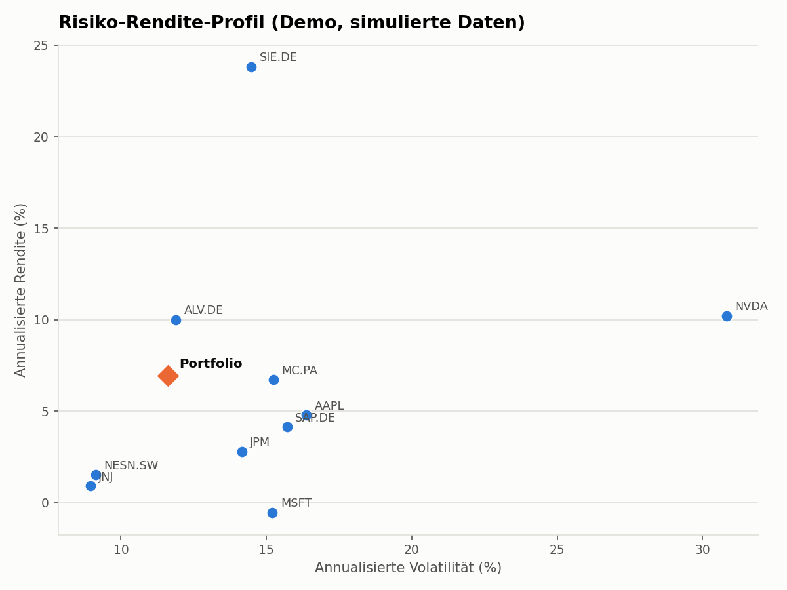
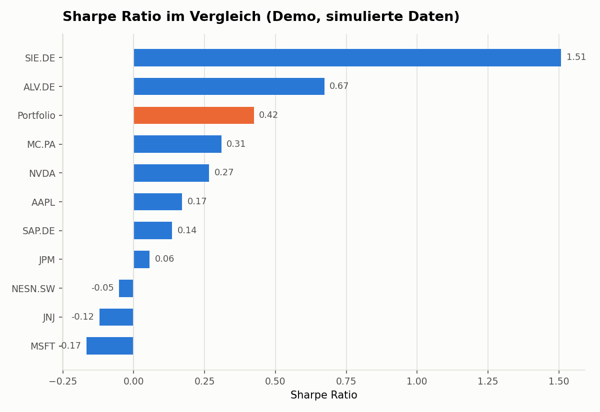
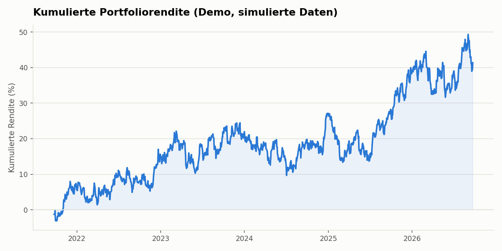
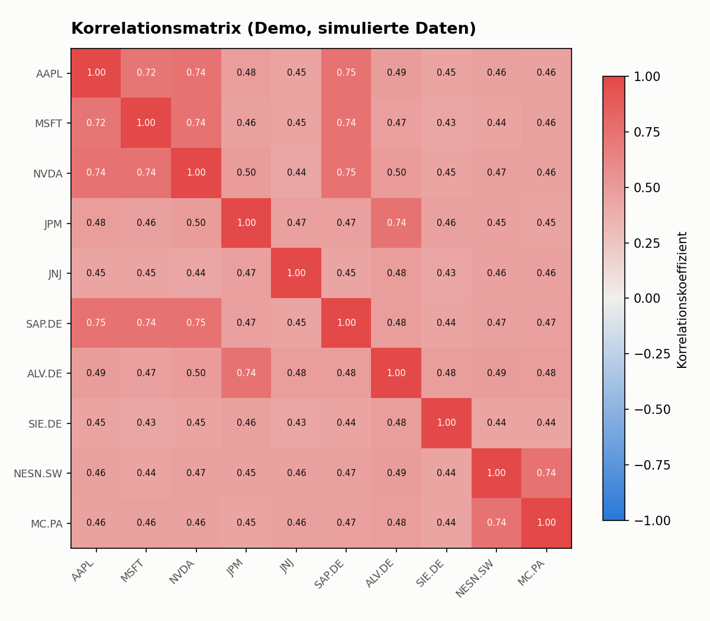

# Portfolioanalyse in Python

Berechnung von annualisierter Rendite, Volatilität und Sharpe Ratio für ein
10-Aktien-Portfolio mit `pandas` und `yfinance`. Enthält Einzeltitel- und
Portfolio-Kennzahlen, eine Korrelationsanalyse sowie automatisch generierte
Charts.

## Beispiel-Output

*Hinweis: Die folgenden Grafiken sind mit **simulierten** Kursdaten erzeugt
(`scripts/generate_demo_output.py`), damit das Repository auf Anhieb
Beispielergebnisse zeigt. Für eine Analyse mit echten Marktdaten `python
analyze.py` ausführen (siehe unten) — dafür wird eine Internetverbindung zu
Yahoo Finance benötigt.*

| Risiko-Rendite-Profil | Sharpe Ratio im Vergleich |
|---|---|
|  |  |

| Kumulierte Portfoliorendite | Korrelationsmatrix |
|---|---|
|  |  |

## Methodik

Für jeden Titel werden aus den täglichen (einfachen) Renditen folgende
Kennzahlen berechnet und auf ein Jahr (252 Handelstage) annualisiert:

- **Annualisierte Rendite** – geometrisch: `(1 + r_täglich).prod() ** (252/n) - 1`
- **Annualisierte Volatilität** – `std(r_täglich) * sqrt(252)`
- **Sharpe Ratio** – `(annualisierte Rendite − risikofreier Zins) / annualisierte Volatilität`

Die Portfolio-Kennzahlen werden auf Basis der **gewichteten täglichen
Portfoliorendite** (nicht durch einfache Mittelung der Einzelkennzahlen)
berechnet, was Diversifikationseffekte korrekt abbildet. Der risikofreie
Zins ist in `src/config.py` als Näherungswert hinterlegt (Standard: 2 % p.a.)
und sollte bei Bedarf an die aktuelle Zinslandschaft angepasst werden.

Alle Berechnungen sind in `tests/test_metrics.py` gegen bekannte
Referenzwerte (analytisch bzw. synthetisch) abgesichert.

## Portfolio

Bewusst diversifiziertes Beispielportfolio (gleichgewichtet, 10 % je
Position) über Sektoren und Regionen hinweg:

| Ticker | Unternehmen | Region | Sektor |
|---|---|---|---|
| AAPL | Apple | USA | Technologie |
| MSFT | Microsoft | USA | Technologie |
| NVDA | Nvidia | USA | Halbleiter |
| JPM | JPMorgan Chase | USA | Finanzen |
| JNJ | Johnson & Johnson | USA | Gesundheit |
| SAP.DE | SAP SE | Deutschland | Software |
| ALV.DE | Allianz SE | Deutschland | Versicherung |
| SIE.DE | Siemens AG | Deutschland | Industrie |
| NESN.SW | Nestlé SA | Schweiz | Konsumgüter |
| MC.PA | LVMH | Frankreich | Luxusgüter |

Ticker, Gewichte, Zeitraum und risikofreier Zins lassen sich zentral in
[`src/config.py`](src/config.py) anpassen.

## Projektstruktur

```
portfolio-analysis/
├── analyze.py                    # Haupt-Skript (echte Marktdaten via yfinance)
├── src/
│   ├── config.py                 # Ticker, Gewichte, Zeitraum, risikofreier Zins
│   ├── data_loader.py            # Kursdaten-Download & Renditeberechnung
│   ├── metrics.py                # Rendite, Volatilität, Sharpe Ratio, Korrelation
│   └── visualize.py              # Charts (matplotlib)
├── scripts/
│   └── generate_demo_output.py   # Beispieloutput mit simulierten Daten (offline)
├── tests/
│   └── test_metrics.py           # Unit-Tests (pytest, keine Netzwerkabhängigkeit)
└── output/                       # Generierte CSVs & Charts
```

## Installation & Nutzung

```bash
git clone <repo-url>
cd portfolio-analysis
pip install -r requirements.txt

# Echte Analyse mit aktuellen Marktdaten (benötigt Internetverbindung)
python analyze.py

# Tests ausführen
pytest tests/ -v

# Beispieloutput mit simulierten Daten neu erzeugen (offline)
python scripts/generate_demo_output.py
```

`analyze.py` lädt die letzten 5 Jahre adjustierter Schlusskurse für alle 10
Titel, berechnet die Kennzahlen je Einzeltitel und fürs Gesamtportfolio und
speichert Ergebnistabellen (`output/asset_metrics.csv`,
`output/portfolio_metrics.csv`) sowie vier Charts in `output/`.

## Nächste Schritte / mögliche Erweiterungen

- Effizienzlinie (Markowitz) und Portfolio-Optimierung (Minimum-Varianz,
  Tangentialportfolio)
- Rolling-Window-Kennzahlen (z. B. 1-Jahres-rollierende Sharpe Ratio)
- Benchmark-Vergleich (z. B. gegen MSCI World / DAX)
- Value-at-Risk (VaR) und Conditional VaR

## Lizenz

MIT License, siehe [LICENSE](LICENSE).
